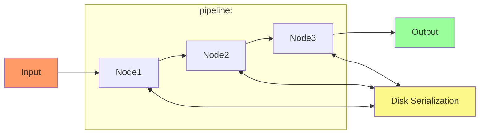
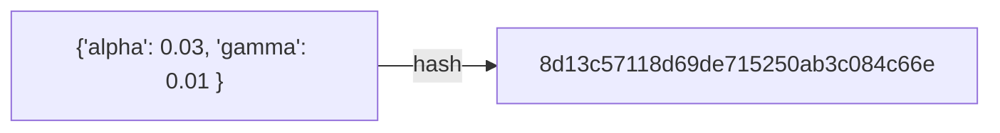
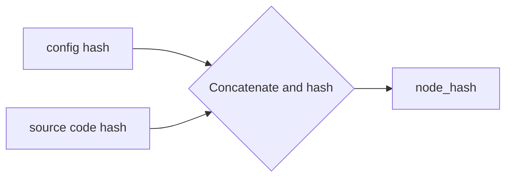

# About

## Main Components
### 1. Node

#### What
A single logical unit of computation, this could include generating data, applying transformations, training models or generating results. 


Each node extends the `BaseNode` class from mlpipeline package. Following diagram shows the relevant methods and attributes of the BaseNode class:

```mermaid
classDiagram
      BaseNode <|-- Node
      BaseNode : +config: Dict
      BaseNode: +__init__( config: Dict )
      BaseNode: +hash( ) -> str
      BaseNode: +run( input: Dict ) -> Dict
```

#### Why
* This sort of structure forces the user to experiment in the form of logical chunks each responsible for a specific task
* It allows allows us to uniquely identify a node run based on:
    1. config
    2. source code for the node class
    3. input to the run function
* Since we can identify runs uniquely, it allows us to reuse existing results from previous runs
* Unlike sklearn pipelines here input and output of the `run` method are dictionaries, allowing data other than arrays or dataframes


### 2. Pipeline
Runs a series of nodes on an input consecutively

It is responsible for:


1. Collecting all the node objects
2. Calling the `run` method for each of the node objects
3. Identifying based on the node and input hash if a run on same data has happened previously, if so then reusing the saved outputs 
4. Storing all the intermediate results (if not already saved): config, ouput and source code 
5. Logging for each stage
---

## The entire process

For each node object within a pipeline:

1. Convert the config dict into string and calcuate its hash (currently MD5)

2. Get the source code for the object's class and calcuate its hash
3. Compute the `node_hash`: hash of the concatenated string of previous two hash values

4. Create a folder by the name `[node_class]_[node_hash]`, for example `ClassifierNode_8d13c57118d69de715250ab3c084c681`
5. Store the config as json, source code for the node class as a python file and the node object as a pickle in the created folder
6. Convert the input dict to the run method into a string and compute the `input_hash`
7. Create a folder `[node_class]_[node_hash]/input_[input_hash]` 